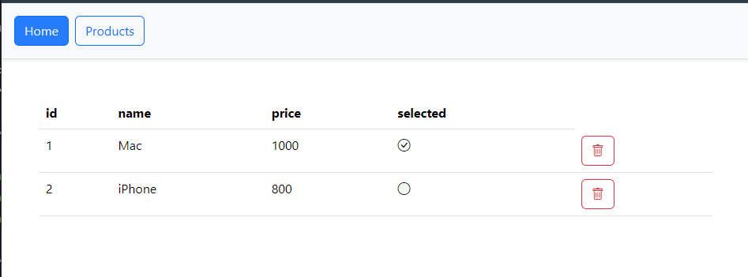

# Projet de Gestion de Produits - Angular

## Description

Ce projet est une application Angular de gestion de produits. Il permet de visualiser, ajouter, modifier et supprimer des produits. L'application communique avec une API backend pour récupérer et manipuler les données des produits.

## Technologies Utilisées

*   Angular
*   TypeScript
*   HTML
*   CSS
*   Bootstrap
*   RxJS
*   HttpClient (pour les requêtes HTTP)

## Prérequis

Avant de commencer, assurez-vous d'avoir installé les éléments suivants :

*   [Node.js](https://nodejs.org/) (version 16 ou supérieure)
*   [npm](https://www.npmjs.com/) (Node Package Manager)
*   [Angular CLI](https://cli.angular.io/) (dernière version)


## Configuration

Configurez l'URL de l'API backend dans le fichier `src/app/services/products.service.ts`. Assurez-vous que l'API backend est en cours d'exécution.

```typescript
  return this.http.get("http://localhost:8081/api/products/products");
```

## Lancement de l'Application

Pour lancer l'application en mode développement, utilisez la commande suivante :

```bash
ng serve
```

Ouvrez votre navigateur et accédez à `http://localhost:4200/`.

## Fonctionnalités

*   **Affichage des produits :** Visualisation de la liste des produits avec leurs détails (nom, prix, sélection).
*   **Suppression de produits :** Suppression d'un produit existant.

## Structure du Projet

*   `src/app/products/products.component.ts`: Composant principal pour la gestion des produits.
*   `src/app/products/products.component.html`: Template HTML pour l'affichage des produits.
*   `src/app/services/products.service.ts`: Service Angular pour la communication avec l'API backend.

## Démonstration

### Capture d'écran 1: Liste des produits


### Capture d'écran 2: Suppression d'un produit


